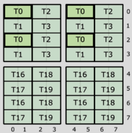
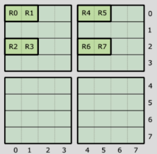
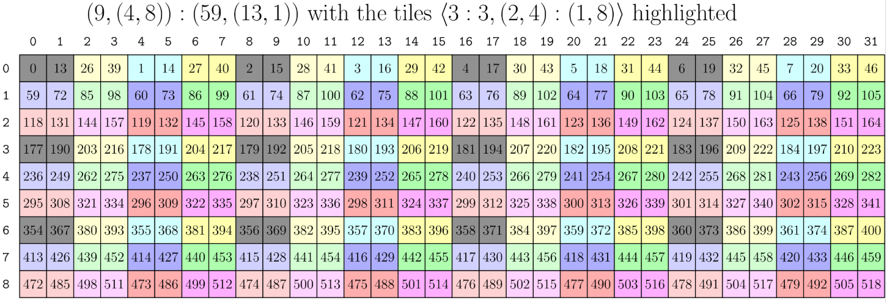
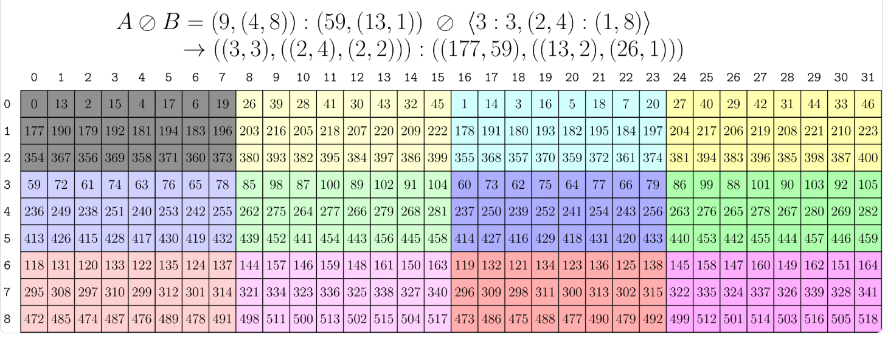
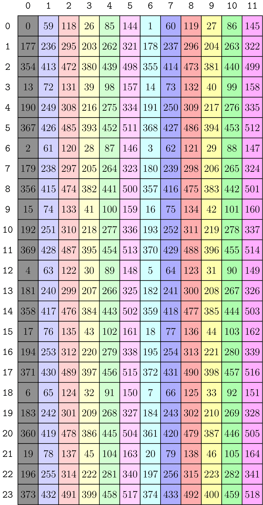

# Notes on CuTeDSL

Last updated: 2025-07-14

$$
\begin{align*}
 &\color{red}\text{Note: Work in progress.} \\
 &\color{red}\text{The content is not complete and may contain errors.} \\
\end{align*}
$$

## Overall Workflow of Building and Running a GPU Kernel Using CuTeDSL

CuTeDSL is a low level programming model that is fully consistent with CuTe C++ abstractions — exposing core concepts such as layouts, tensors, hardware atoms, and full control over the hardware thread and data hierarchy. It is a domain-specific language (DSL) for CUDA programming, which allows users to write many CUDA kernels in Python.

### Why CuTeDSL?

Before CuTeDSL, CUDA programming was done in C++ with the CUTLASS library, which is a collection of abstractions for implementing high-performance matrix-matrix multiplication (GEMM) and related computations at all levels and scales within CUDA. Writing CUDA kernels in C++ is pretty cumbersome, as it requires direct interaction with CUDA's low-level memory management, thread synchronization, and other hardware-specific details. [^1] Although dealing with these low-level details can lead to highly optimized code, it also makes the learning curve steep and demands a mature understanding of C++ and CUDA programming. Therefore, CuTeDSL is designed to provide a more user-friendly interface for CUDA programming, allowing users to write CUDA kernels in Python while still maintaining the performance and flexibility of CUTLASS.

### Overall Structure and Workflow

A typical CuTeDSL program consists of three parts: **a main function, a host function, and a kernel function**. Below is an example script of such a program.

```python
import cutlass
import cutlass.cute as cute
from cutlass.cute.runtime import from_dlpack
# Other necessary imports

@cute.kernel
def my_function_kernel(...):
    """The kernel function that runs on the GPU."""
    # Perform parallel computation here

@cute.jit
def my_function(...):
    """The host function that runs on the CPU."""
    # Set up tensor layouts, memory management
    my_function_kernel(...).launch(...) # Launch the kernel

def main():
    """The entry point of the program."""
    # 1. Prepare the input data, such as matrices or tensors
    # 2. Compile the kernel
    compiled_func = cute.compile(my_function, args=...)
    # 3. Execute the host function
    compiled_func(...)
```

Although the above code is a most simplified version, it illustrates the essential structure of a CuTeDSL program. The key components are:

- **The main function** runs on the CPU and is responsible for data preparation, program compilation, and execution orchestration
- **The host function** (decorated with `@cute.jit`) runs on the CPU and handles tensor layout setup, memory management, and kernel launching
- **The kernel function** (decorated with `@cute.kernel`) runs on the GPU and performs the actual parallel computation
  - `@cute.jit` stands for "just-in-time compilation". When calling `cute.compile(my_function, args=...)`, CuTeDSL analyzes the function and identifies the kernel function within it (decorated with `@cute.kernel`). It then compiles the kernel function into CUDA PTX code that can be run on the GPU, and compiles the host function into an optimized executable that can be run on the CPU. The two functions are linked together into a single executable.
  - `@cute.kernel` tells CuTeDSL that this function is a kernel function that will be executed on the GPU. Every GPU thread will execute this function in parallel, and the function within should be compiled to CUDA PTX code.

The execution flow is:

```text
main function → compilation → host function → kernel launch → GPU execution
```


## `elementwise_add.py` for Ampere GPU in CuTeDSL

The elementwise addition of two matrices is the most basic operation in linear algebra: you simply add the corresponding elements of two matrices together. However, to perform parallel computation on a GPU, what we need to consider is not how to "add", but how to clearly describe the distribution of the workload across multiple threads, registers, and how to transfer the data among global memory (gmem) and register memory (rmem). Before diving into details, obtaining a high-level mental map of the overall workflow is imperative.

We use $A$ and $B$ to denote the input matrices (tensors), and $C$ to denote the output matrix (tensor).

- **In the main function**, we prepare the input data $A$ and $B$ (usually from `torch.tensor`) and an empty output tensor $C$, and transform them into `cute.Tensor` objects. Apart from the info that `torch.tensor` provides, `cute.Tensor` also contains the layout information of the tensor.
- **In the host function**, we slice the tensors $A$, $B$ and $C$ into smaller tiles, with each tile to be handled by a thread block (CTA block), and rearrange the tensors by placing the elements within the same tile in the same column. Such operation is called the **zipped division**. This way, each thread block can easily access the elements it needs to process by extracting an entire column of the rearranged tensor. We also specify how the threads within a thread block and the values (accumulators, registers) within a thread are arranged; such layout is called the **thread-value layout** (TV layout). Finally, to avoid that the tensor size is not divisible by the tile size, we also create a coordinate tensor `cC` that will serve as a mask to indicate which elements of the output tensor $C$ are valid.
- **In the kernel function**, we first fetch the data -- sliced tensors `thrA`, `thrB` and `thrC` -- that the current thread needs to process based on the current thread id (`tidx`) and block id (`bidx`). These data are currently stored in gmem; we then allocate fragments `frgA`, `frgB` and `frgC` in rmem, and load the data from gmem to rmem. The real computation (addition) is thereby performed in rmem, and the results are stored in `frgC`. Finally, we store the results back to gmem.

### Details of Python Kernel Implementation

Most parts of the kernel implementation follow the [above workflow](#overall-structure-and-workflow) and are straightforward. The following sections will focus on the details of TV layout, zipped division, and tensor slicing behind the scenes.

#### TV Layout

*Credit: Much of the materials in this section are adapted from the [NVIDIA CUTLASS Documentation (0t_mma_atom)](https://docs.nvidia.com/cutlass/media/docs/cpp/cute/0t_mma_atom.html).*

TV layout is a short for "thread-value layout". First introduced in Volta GPU (spanning Turing and Ampere), this layout is used to describe how *threads* within a QP (quadpair, a group of 8 threads) and *values* (accumulators, registers) within a thread, labeled by `(logical_thr_id, logical_val_id)`, map to the logical tensor indices `(m, n)` [^2].

Let's investigate an example below, of an 8x8 matrix:



Each thread owns 8 values. To describe the layout, first focus on changing `logical_thr_id` while keeping `logical_val_id = 0` fixed:

```text
(T=0, V=0) -> (0, 0) = 0
(T=1, V=0) -> (1, 0) = 1
(T=2, V=0) -> (0, 2) = 16
(T=3, V=0) -> (1, 2) = 17
(T=4, V=0) -> (4, 0) = 4
(T=5, V=0) -> (5, 0) = 5
(T=6, V=0) -> (4, 2) = 20
(T=7, V=0) -> (5, 2) = 21
```

where `T=4,5,6,7` are the 4th, 5th, 6th, 7th logical thread id of the MMA corresponding to thread indices of `16`,`17`,`18`,`19` of the warp. Such mapping between logical and real thread indices is to be recorded in `ThrID` mapping (and this is why we call the above thread indices as "*logical* thread id"). We may infer from `T=0` to `T=7` data that there exist three types of periodicity: `T=0 -> T=1` with stride `1`, `T=0 -> T=2` with stride `16`, and `T=0 -> T=4` with stride `4`. The layout of `logical_thr_id` is thus described as:

```cpp
using ThreadLayout = Layout<Shape<_2, _2, _2>, Stride<_1, _16, _4>>;
```

> It is worth pointing out that the above `ThreadLayout` has already taken the positions of registers (accumulators) into account. If we solely extract the thread indices, the 8 threads would be arranged in a 4x2 grid:
> 
> ```text
> T0 T2
> T1 T3
> T4 T6
> T5 T7
> ```
>
> Such thread arrangement can be described as:
> 
> ```cpp
> using ThreadLayout = Layout<Shape<_2, _2, _2>, Stride<_1, _4, _2>>;
> ```
>
> In examples such as `elementwise_add.py`, the latter `ThreadLayout` is used. See below for more details.

Next, fix `logical_thr_id = 0` and change `logical_val_id`. But first, we need to specify how values are ordered within a thread. The picture below illustrates the value ordering:



Given such ordering, we can now describe the mapping of `logical_val_id` to `(m, n)` indices:

```text
(T=0, V=0) -> (0, 0) = 0
(T=0, V=1) -> (0, 1) = 8
(T=0, V=2) -> (2, 0) = 2
(T=0, V=3) -> (2, 1) = 10
(T=0, V=4) -> (0, 4) = 32
(T=0, V=5) -> (0, 5) = 40
(T=0, V=6) -> (2, 4) = 34
(T=0, V=7) -> (2, 5) = 42
```

The rule is clear: there also exist three types of periodicity: `V=0 -> V=1` with stride `8`, `V=0 -> V=2` with stride `2`, and `V=0 -> V=4` with stride `32`. The layout of `logical_val_id` can thus described as:

```cpp
using ValLayout = Layout<Shape<_2, _2, _2>, Stride<_8, _2, _32>>;
```

Finally, we can combine the two layouts to get the TV layout:

```cpp
using TVLayout = Layout<Shape <Shape <_2,  _2, _2>, Shape <_2, _2,  _2>>,
                        Stride<Stride<_1, _16, _4>, Stride<_8, _2, _32>>>;
```

#### TV Layout in `elementwise_add.py`

Ampere GPU uses a `128 = 4 x 32` thread block arrangement:

```text
    +----+----+----+----+-----+----+
    |    | 0  | 1  | 2  | ... | 31 |
    +----+----+----+----+-----+----+
    | 0  | T0 | T1 | T2 | ... | T31|
    +----+----+----+----+-----+----+
    | 1  |T32 |T33 |T34 | ... |T63 |
    +----+----+----+----+-----+----+
    | 2  |T64 |T65 |T66 | ... |T95 |
    +----+----+----+----+-----+----+
    | 3  |T96 |T97 |T98 | ... |T127|
    +----+----+----+----+-----+----+
```

As input tensors are laid out in row-major order, we must also use a row-major TV layout. The above `ThreadLayout` can be described as `(4,32):(32,1)`, or equivalently in Python:

```python
thr_layout = cute.make_ordered_layout((4, 32), order=(1, 0))
```

> This `thr_layout` is the layout after extracting the thread indices, as explained above.

The `make_ordered_layout` function aligns strides with the order of the dimensions without manual specification.

Ampere GPU supports a maximum of 128-bit load/store operations, which means it can load `128 // dtype.width` elements per thread. The shape of the value layout is `(4, 128 // dtype.width)`. *(A bit confused here: does this mean each thread executes four 128-bit load/store operations at a time? Why can the number of registers (values) be changed--or does it just mean that the number of registers is always 4 per thread, but the number of elements per register is `128 // dtype.width`, i.e. each register is sliced? Copilot thinks the latter is true.)* `cute` provides a convenient function `make_layout_tv` to create a TV layout using `thr_layout` and `val_layout`:

```python
val_layout = cute.make_layout((4, 128 // dtype.width), order=(1, 0)) # as explained before, using row-major layouts
tiler_mn, tv_layout = cute.make_layout_tv(thr_layout, val_layout)
```

The `tiler_mn` is the tiling size `(num_vals, num_thrs)` [^3], which is `(4 * 128 // dtype.width, 128)` in this case. 

> In the example script, when dealing with `Float32` data type, `dtype.width` is `32`, so `128 // dtype.width` is `4`. The `thr_layout` is `(4, 32):(32, 1)` and the `val_layout` is `(4, 4):(4, 1)`. The resulting tiler and TV layout are:
> 
> ```text
> tiler_mn = (16, 128) per thread block
> tv_layout = ((32,4),(4,4)):((64,4),(16,1))
> ```

#### Zipped Division

In CuTe layout, `zipped_divide` is the function that picks out the desired pieces of blocks specified by the tiler, and "zipped" them altogether one by one. Let's take a look at an example from [CuTe Layout Documentations](https://github.com/NVIDIA/cutlass/blob/main/media/docs/cpp/cute/02_layout_algebra.md).

The layout is `(9,(4,8)):(59,(13,1))`, which can be visualized as the 2D `9x32` matrix below. The tiler is also a layout, specified by `<3:3, (2,4):(1,8)>`, which means picking out the blocks that satisfy: the first row of every 3 rows, and the first 2 columns of every 8 columns. [^4] These picked out blocks (`3 * 8 = 24` blocks) are colored in grey in the picture below. We may repeat such pattern, pick out different blocks and color the selected blocks with the same color, through which every block is uniquely "classified".



Now we can introduce what *division* is. The term "division" here is misleading, as it does not stand for "dividing" some blocks out; rather, it's more like "selecting" and "reorganizing" the original blocks, based on a specific standard (the tiler). The picture below illustrates the **logical division** of the above layout with respect to the tiler. The blocks falling into the same "category" (namely, the same color) are grouped together, and the blocks in each group are arranged in a 2D matrix matching the shape of the tiler.



Logical divisions successfully reorganize and regroup the original blocks. However, if we want to pick out one specific block, we still need to traverse and slice the 2D matrix both in the row and column directions, which is not convenient. This is where the **zipped division** comes in: it *zips* the blocks within each group together and arranges them in a 1D array. After zipped division, if we want to pick out the $n$-th block, we can simply access the $n$-th column of the zipped division tensor, as shown in the picture below.



> So far, both divisors and dividends are layouts. When they are simply tensors (without specifying the layout stride), they are by default regarded as tilers with stride 1 in every dimension. For example, `tiler_mn = (32, 128)` is equivalent to `<32:1, 128:1>` -- picking out every 32 x 128 blocks, quite straightforward. 

Given the knowledge of `zipped_divide`, we can now understand the code snippet in `elementwise_add.py`. 

```python
gA = cute.zipped_divide(mA, tiler_mn)  # ((TileM,TileN),(RestM,RestN))
gB = cute.zipped_divide(mB, tiler_mn)  # ((TileM,TileN),(RestM,RestN))
gC = cute.zipped_divide(mC, tiler_mn)  # ((TileM,TileN),(RestM,RestN))

idC = cute.make_identity_tensor(mC.shape)
cC = cute.zipped_divide(idC, tiler=tiler_mn)
```

`gA`, `gB` and `gC` are the tiled tensors of `mA`, `mB` and `mC`, given the tiler `tiler_mn` (for instance, `(32, 128)`). Every tile correspond to the data that a thread block (of 128 threads) needs to process. Since `tiler_mn` is only a tuple of default layout, such tiled division is actually more straightforward than imagined: it simply picks every `32 * 128` elements from the original tensor out based on the tensor's layout, and groups them together in the first mode. `cC` is the coordinate tensor, which is used to store the coordinates of the tiles in the original tensor. Having the coordinate tensor is necessary to avoid the situation where the tensor size is not divisible by the tile size: together with the original shape of the tensor, it can be used to mask out the invalid elements in the output tensor `C`.

#### Tensor Slicing

As illustrated in the above workflow, two slicing operations are performed in the kernel function: one is to obtain the thread block sub-tensors `blkA`, `blkB`, and `blkC` from the full tensors `gA`, `gB`, and `gC` (tiled and divided), and the other is to obtain the thread sub-tensors `thrA`, `thrB`, and `thrC` from the thread block sub-tensors `blkA`, `blkB`, and `blkC`.

**1. Slice the tensors given block id**

Thanks to the zipped division, we can easily get the thread block sub-tensors `blkA`, `blkB`, and `blkC` by obtaining an entire column of the tiled tensors `gA`, `gB`, and `gC`.

```python
bidx, _, _ = cute.arch.block_idx() # block id; both _s are 0

# slice for CTAs
# logical id -> address
blk_coord = ((None, None), bidx)
blkA = gA[blk_coord]  # (TileM,TileN)
blkB = gB[blk_coord]  # (TileM,TileN)
blkC = gC[blk_coord]  # (TileM,TileN)
blkCrd = cC[blk_coord]  # (TileM, TileN)
```

**2. Slice the block sub-tensors given thread id**

Given the thread block sub-tensors, extracting the thread sub-tensors is not as straightforward as before, as we need to consider the complicated TV layout. Such operation is performed by three steps:

- Create a `tiled_copy` object using `cute.make_tiled_copy`, which takes the TV layout, tiler size, and a "copy atom" as inputs.
- Specify which thread to extract by using `tiled_copy.get_slice(tidx)`, where `tidx` is the thread id.
- Partition the thread block sub-tensors using `partition_S` method, where `S` refers to the "source" tensor, as opposed to the "destination" tensor, `D`.

```python
tidx, _, _ = cute.arch.thread_idx() # thread id; both _s are 0

# Declare the copy atoms
copy_atom_load = cute.make_copy_atom(cute.nvgpu.CopyUniversalOp(), gA.element_type)
copy_atom_store = cute.make_copy_atom(cute.nvgpu.CopyUniversalOp(), gC.element_type)

# Create tiled copies for loading and storing
tiled_copy_A = cute.make_tiled_copy(copy_atom_load, tv_layout, tiler_mn)
tiled_copy_B = cute.make_tiled_copy(copy_atom_load, tv_layout, tiler_mn)
tiled_copy_C = cute.make_tiled_copy(copy_atom_store, tv_layout, tiler_mn)

# Create thread copy objects for the current thread
thr_copy_A = tiled_copy_A.get_slice(tidx)
thr_copy_B = tiled_copy_B.get_slice(tidx)
thr_copy_C = tiled_copy_C.get_slice(tidx)

# Slice the thread block sub-tensors to get the thread sub-tensors
thrA = thr_copy_A.partition_S(blkA)
thrB = thr_copy_B.partition_S(blkB)
thrC = thr_copy_C.partition_S(blkC)
```

#### Memory Transfer Between GMEM and RMEM

(TBA.)

### Lowering Process to Backend

Of all the operations in the intermediate MLIR dumps, some are straightforward and can be directly translated to LLVM IR, while others require a step-by-step lowering process. The following sections will categorize the operations and illustrate how they are lowered to LLVM IR.

#### Straightforward operations

Straightforward operations are mostly direct extraction or combination of the numbers from shape, stride, etc., or straightforward computation. These operations stay in the code until the first `ConvertToLLVMPass (convert-to-llvm)`.

- `cute.get_layout(tensor)`
- `cute.get_shape(layout)`
- `cute.get_strides(layout)`
- `cute.get_iter(tensor)`
- `cute.get_leaves(IntTuple)`
- `cute.get_scalars(layout)`, `cute.get_scalars(layout) <{only_dynamic}>`
- `cute.make_coord(...)`
- `cute.make_shape(...)`
- `cute.make_stride(...)`
- `cute.make_layout(shape, stride)`
- `cute.crd2idx(coord, layout)` (appears in intermediate steps)

We can take `cute.get_shape(layout)` as an example to see its translation to llvm IR. The original code is:

```mlir
// !memref_gmem_f32_2 = !cute.memref<f32, gmem, "((1,(4,4)),1,1):((0,(1,?)),0,0)">
%lay_19 = cute.get_layout(%arg2) : !memref_gmem_f32_2
%105 = cute.get_shape(%lay_19) : (!cute.layout<"(?,?):(?,1)">) -> !cute.shape<"(?,?)">
```

After the first `ConvertToLLVMPass (convert-to-llvm)`, it is lowered to:

```mlir
// Layout %lay_19
%124 = llvm.extractvalue %arg2[0] : !llvm.struct<(ptr<1>, struct<(struct<(i32, i32)>, i32)>)> 
// Shape %105
%177 = llvm.mlir.undef : !llvm.struct<(ptr<1>, struct<(struct<(i32, i32)>, struct<(i32, i32)>)>)>
%178 = llvm.insertvalue %124, %177[0] : !llvm.struct<(ptr<1>, struct<(struct<(i32, i32)>, struct<(i32, i32)>)>)>
```

#### Not-so-straightforward operations

Not-so-straightforward operations are those that require step-by-step lowering process. The slicing operations, in particular, are among the most complicated ones, as they involve dealing with the layouts of the tensors. Moreover, the memory transfer operations between global memory (gmem) and register memory (rmem) also require careful handling of the layouts and pointers; they haven't been included here yet.

- `cute.slice(tensor, coord)`, of type `!memref_gmem_f32_1 = !cute.memref<f32, gmem, "(16,128):(?,1)">`: get the sliced tensor (thread block sub-tensor) given the original tensor and the coordinate. The sliced tensor was then passed to `cute.tiled.copy.partition_S` to get the thread sub-tensor.
  - very beginning:
    ```mlir
    %slice = cute.slice(%arg0, %coord) : !memref_gmem_f32_, !cute.coord<"((_,_),?)">
    ```
  - lowering step 1 (`CuteExpandOps (cute-expand-ops)`): solely extract the layout of the tensor, while leaving the pointer part to
    ```mlir
    %lay_57 = cute.get_layout(%arg0) : !memref_gmem_f32_
    %slice = cute.slice(%lay_57, %coord) : !cute.layout<"((16,128),(?,?)):((?,1),(?{div=16},128))">, !cute.coord<"((_,_),?)">
    ```
    instead of directly passed to `partition_S`, `%slice` is passed to `%view = cute.make_view(%ptr, %slice)` to create the thread block sub-tensor; this `%view` plays the role of the original `%slice`
    ```mlir
    %idx = cute.crd2idx(%coord, %lay_57) : (!cute.coord<"((_,_),?)">, !cute.layout<"((16,128),(?,?)):((?,1),(?{div=16},128))">) -> !cute.int_tuple<"?{div=16}"> // offset
    %iter_58 = cute.get_iter(%arg0) : !memref_gmem_f32_
    %ptr = cute.add_offset(%iter_58, %idx) : (!cute.ptr<f32, gmem>, !cute.int_tuple<"?{div=16}">) -> !cute.ptr<f32, gmem>
    %view = cute.make_view(%ptr, %slice) : !memref_gmem_f32_1
    ```
  - lowering step 2 (`ConvertCuteAlgoToArch (convert-cute-algo-to-arch)`): no more intermediate `%slice` to create `%view`; rather, the layout of the sliced tensor is directly extracted from the original layout, and the pointer, together with the extracted layout, is passed to `cute.make_view(ptr, layout)`
    ```mlir
    %lay_57 = cute.get_layout(%arg0) : !memref_gmem_f32_
    // since %coord is `((None, None), bid)`, we need to equivalently extract the layout of the first mode
    %31:4 = cute.get_scalars(%lay_57) <{only_dynamic}> : !cute.layout<"((16,128),(?,?)):((?,1),(?{div=16},128))">
    %shape = cute.make_shape() : () -> !cute.shape<"(16,128)">
    %stride = cute.make_stride(%31#2) : (i32) -> !cute.stride<"(?,1)">
    %lay_58 = cute.make_layout(%shape, %stride) : !cute.layout<"(16,128):(?,1)">
    // %ptr part remains the same
    %idx = cute.crd2idx(%coord, %lay_57) : (!cute.coord<"((_,_),?)">, !cute.layout<"((16,128),(?,?)):((?,1),(?{div=16},128))">) -> !cute.int_tuple<"?{div=16}">
    %iter_59 = cute.get_iter(%arg0) : !memref_gmem_f32_
    %ptr = cute.add_offset(%iter_59, %idx) : (!cute.ptr<f32, gmem>, !cute.int_tuple<"?{div=16}">) -> !cute.ptr<f32, gmem>
    %view = cute.make_view(%ptr, %lay_58) : !memref_gmem_f32_1
    ```
  - `cute.make_view(ptr, layout)` stays in the code until the first `ConvertToLLVMPass (convert-to-llvm)`
- `cute.atom()`, `cute.make_tiled_copy(atom)`, `cute.tiled.copy.partition_S(tiled_copy, slice, tidx)`: get the partitioned thread sub-tensor given the sliced tensor and the thread id. These three operations should be seen as a whole, for they are lowered as a whole as well
  - very beginning:
    ```mlir
    %24 = nvvm.read.ptx.sreg.tid.x : i32
    %atom = cute.atom() : !cute_nvgpu.atom.universal_copy<f32>
    %30 = cute.make_tiled_copy(%atom) : !copy_simt
    %coord_74 = cute.make_coord(%24) : (i32) -> !cute.coord<"?">
    %src_partitioned = cute.tiled.copy.partition_S(%30, %slice, %coord_74) : (!copy_simt, !memref_gmem_f32_1, !cute.coord<"?">) -> !memref_gmem_f32_2
    ```
  - lowering (`ConvertCuteAlgoToArch (convert-cute-algo-to-arch)`): note that during this step, the sliced thread block sub-tensor `%slice` is replaced by `%view` (of layout `(16,128):(?,1)`)
    ```mlir
    %24 = nvvm.read.ptx.sreg.tid.x : i32
    // preparation
    %iter_95 = cute.get_iter(%view) : !memref_gmem_f32_1
    %lay_96 = cute.get_layout(%view) : !memref_gmem_f32_1
    %37 = cute.get_scalars(%lay_96) <{only_dynamic}> : !cute.layout<"(16,128):(?,1)"> // obtain the dynamic part (?) in tv layout
    %coord_94 = cute.make_coord(%24) : (i32) -> !cute.coord<"?"> 
    %38 = cute.get_scalars(%coord_94) <{only_dynamic}> : !cute.coord<"?"> // nothing but the thread id

    // Compute the offset of the tid thread within the thread block; the result is stored in %46
    %c4_i32 = arith.constant 4 : i32
    %40 = arith.muli %37, %c4_i32 : i32
    %c32_i32 = arith.constant 32 : i32
    %42 = arith.divsi %38, %c32_i32 : i32
    %c32_i32_97 = arith.constant 32 : i32
    %43 = arith.remsi %38, %c32_i32_97 : i32
    %c4_i32_98 = arith.constant 4 : i32
    %44 = arith.muli %43, %c4_i32_98 : i32
    %45 = arith.muli %42, %40 : i32
    %46 = arith.addi %44, %45 : i32
    // %46 = (tid mod 32) * 4 + (tid / 32) * (? * 4)
    // This is due to the tv_layout "((32,4),(4,4)):((64,4),(16,1))"; see the explanation below

    // Finally, obtain the partitioned thread sub-tensor %view_103
    %iv = cute.assume(%46) : (i32) -> !cute.i32<divby 4>
    %int_tuple = cute.make_int_tuple(%iv) : (!cute.i32<divby 4>) -> !cute.int_tuple<"?{div=4}">
    %ptr_99 = cute.add_offset(%iter_95, %int_tuple) : (!cute.ptr<f32, gmem>, !cute.int_tuple<"?{div=4}">) -> !cute.ptr<f32, gmem>
    %shape_100 = cute.make_shape() : () -> !cute.shape<"((1,(4,4)),1,1)">
    %stride_101 = cute.make_stride(%37) : (i32) -> !cute.stride<"((0,(1,?)),0,0)">
    %lay_102 = cute.make_layout(%shape_100, %stride_101) : !cute.layout<"((1,(4,4)),1,1):((0,(1,?)),0,0)">
    %view_103 = cute.make_view(%ptr_99, %lay_102) : !memref_gmem_f32_2
    ```
    Explanation is needed for computing `%46`. As said, `%46` represents the offset of the thread with the within the thread block. Given the thread layout `(32,4):(4,4)`, `tid mod 32` and `tid / 32` gives the row and column indices of the thread within the thread block. Each thread owns a `4x4` value matrix; when considering the offset of the thread, we would use the index of the upper left value. Therefore, the `tid mod 32`-th row contributes `(tid mod 32) * 4` to the offset, and the `tid / 32`-th column contributes `(tid / 32) * (? * 4)` to the offset, where `?` is the index leap for every step of the column. [^5] Summing the two terms gives the final offset of the thread within the thread block, which is then used to obtain the final partitioned thread sub-tensor `%view_103`.

[^1]: CUTLASS repository contains many examples using C++ to write CUDA kernels, such as the basic [GEMM operation](https://github.com/NVIDIA/cutlass/tree/main/examples/00_basic_gemm).
[^2]: By default, the logical tensor indices are encoded in column-major order. See the discussion [here](https://github.com/NVIDIA/cutlass/discussions/2197).
[^3]: Note that as opposed to "thread index first, value index second" ordering in tv layout -- a mapping from `(logical_thr_id, logical_val_id)` to the logical tensor index the `(m, n)` -- here we use the opposite order. *Don't get confused, although I don't know why not keeping the consistency. Maybe we'll see why soon.*
[^4]: Flattened to one-dimensional indices, the row tiler `3:3` refers to the indices `0, 3, 6` (which means picking out 1 row out of every 3 rows), and the column tiler `(2,4):(1,8)` refers to the indices `0, 1, 8, 9, 16, 17, 24, 25` (which means picking out 2 columns out of every 8 columns). The more general form of such "tiling and picking out" process is described by *complement* and *composition*. See the [CuTe Layout Documentations](https://github.com/NVIDIA/cutlass/blob/main/media/docs/cpp/cute/02_layout_algebra.md) for more details, although these documentations are hard to grasp as well and I am considering writing a more detailed notes on CuTe layout algebra.
[^5]: I don't quite understand why `?` is not a static 128, though.