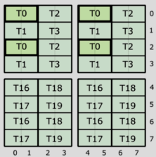
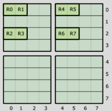
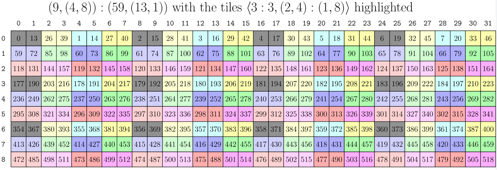
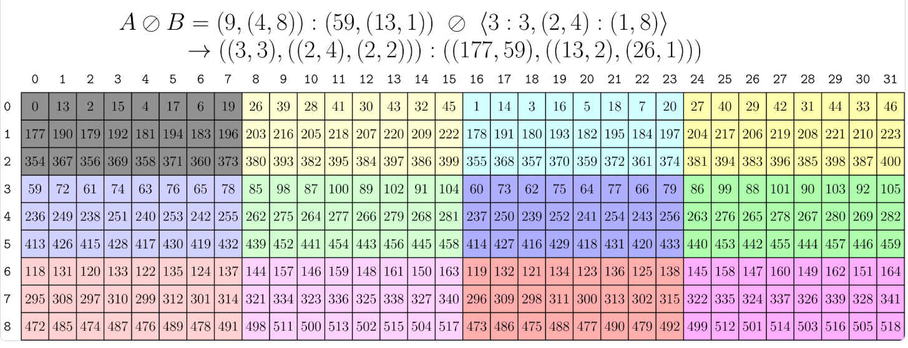
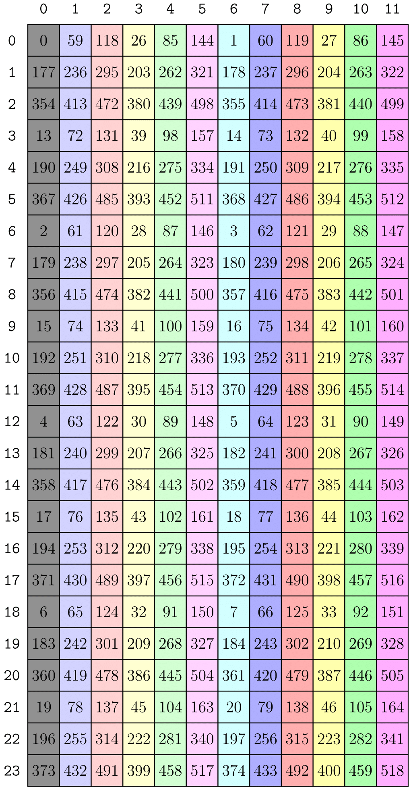

# Notes on CuTeDSL

Last updated: 2025-07-08

$$
\begin{align*}
 &\color{red}\text{Note: Work in progress.} \\
 &\color{red}\text{The content is not complete and may contain errors.} \\
\end{align*}
$$

## Overall Workflow of Running a GPU Kernel Using CuTeDSL

CuTeDSL is a low level programming model that is fully consistent with CuTe C++ abstractions — exposing core concepts such as layouts, tensors, hardware atoms, and full control over the hardware thread and data hierarchy. It is a domain-specific language (DSL) for CUDA programming, which allows users to write many CUDA kernels in Python.

### Why CuTeDSL?

Before CuTeDSL, CUDA programming was done in C++ with the CUTLASS library, which is a collection of abstractions for implementing high-performance matrix-matrix multiplication (GEMM) and related computations at all levels and scales within CUDA. Writing CUDA kernels in C++ is pretty cumbersome, as it requires direct interaction with CUDA's low-level memory management, thread synchronization, and other hardware-specific details. [^1] Although dealing with these low-level details can lead to highly optimized code, it also makes the learning curve steep and demands a mature understanding of C++ and CUDA programming. Therefore, CuTeDSL is designed to provide a more user-friendly interface for CUDA programming, allowing users to write CUDA kernels in Python while still maintaining the performance and flexibility of CUTLASS.

### Overall Structure and Workflow

A typical CuTeDSL program consists of three parts: **a main function, a host function, and a kernel function**.

```python
import cutlass
import cutlass.cute as cute
from cutlass.cute.runtime import from_dlpack
# Other necessary imports

@cute.kernel
def my_function_kernel(...):
    """The kernel function that runs on the GPU."""
    # Perform parallel computation here

@cute.jit
def my_function(...):
    """The host function that runs on the CPU."""
    # Set up tensor layouts, memory management
    my_function_kernel(...).launch(...) # Launch the kernel

def main():
    """The entry point of the program."""
    # 1. Prepare the input data, such as matrices or tensors
    # 2. Compile the kernel
    compiled_func = cute.compile(my_function, args=...)
    # 3. Execute the host function
    compiled_func(...)
```

- **The main function** runs on the CPU and is responsible for data preparation, program compilation, and execution orchestration
- **The host function** (decorated with `@cute.jit`) runs on the CPU and handles tensor layout setup, memory management, and kernel launching
- **The kernel function** (decorated with `@cute.kernel`) runs on the GPU and performs the actual parallel computation
  - `@cute.jit` stands for "just-in-time compilation". When calling `cute.compile(my_function, args=...)`, CuTeDSL analyzes the function and identifies the kernel function within it (decorated with `@cute.kernel`). It then compiles the kernel function into CUDA PTX code that can be run on the GPU, and compiles the host function into an optimized executable that can be run on the CPU. The two functions are linked together into a single executable.
  - `@cute.kernel` tells CuTeDSL that this function is a kernel function that will be executed on the GPU. Every GPU thread will execute this function in parallel, and the function within should be compiled to CUDA PTX code.

The execution flow is:

```text
main function → compilation → host function → kernel launch → GPU execution
```


## `elementwise_add.py` for Ampere GPU in CuTeDSL

### TV Layout

From: [NVIDIA CUTLASS Documentation (0t_mma_atom)](https://docs.nvidia.com/cutlass/media/docs/cpp/cute/0t_mma_atom.html)

TV layout is a short for "thread-value layout". First introduced in Volta GPU (spanning Turing and Ampere), this layout is used to describe how *threads* within a QP (quadpair, a group of 8 threads) and *values* (accumulators, registers) within a thread, labeled by `(logical_thr_id, logical_val_id)`, map to the logical tensor indices `(m, n)` [^2].

Let's investigate an example below, of an 8x8 matrix:



Each thread owns 8 values. To describe the layout, first focus on changing `logical_thr_id` while keeping `logical_val_id = 0` fixed:

```text
(T=0, V=0) -> (0, 0) = 0
(T=1, V=0) -> (1, 0) = 1
(T=2, V=0) -> (0, 2) = 16
(T=3, V=0) -> (1, 2) = 17
(T=4, V=0) -> (4, 0) = 4
(T=5, V=0) -> (5, 0) = 5
(T=6, V=0) -> (4, 2) = 20
(T=7, V=0) -> (5, 2) = 21
```

where `T=4,5,6,7` are the 4th, 5th, 6th, 7th logical thread id of the MMA corresponding to thread indices of `16`,`17`,`18`,`19` of the warp. Such mapping between logical and real thread indices is to be recorded in `ThrID` mapping (and this is why we call the above thread indices as "*logical* thread id"). We may infer from `T=0` to `T=7` data that there exist three types of periodicity: `T=0 -> T=1` with stride `1`, `T=0 -> T=2` with stride `16`, and `T=0 -> T=4` with stride `4`. The layout of `logical_thr_id` is thus described as:

```cpp
using ThreadLayout = Layout<Shape<_2, _2, _2>, Stride<_1, _16, _4>>;
```

> It is worth pointing out that the above `ThreadLayout` has already taken the positions of registers (accumulators) into account. If we solely extract the thread indices, the 8 threads would be arranged in a 4x2 grid:
> 
> ```text
> T0 T2
> T1 T3
> T4 T6
> T5 T7
> ```
>
> Such thread arrangement can be described as:
> 
> ```cpp
> using ThreadLayout = Layout<Shape<_2, _2, _2>, Stride<_1, _4, _2>>;
> ```
>
> In examples such as `elementwise_add.py`, the latter `ThreadLayout` is used. See below for more details.

Next, fix `logical_thr_id = 0` and change `logical_val_id`. But first, we need to specify how values are ordered within a thread. The picture below illustrates the value ordering:



Given such ordering, we can now describe the mapping of `logical_val_id` to `(m, n)` indices:

```text
(T=0, V=0) -> (0, 0) = 0
(T=0, V=1) -> (0, 1) = 8
(T=0, V=2) -> (2, 0) = 2
(T=0, V=3) -> (2, 1) = 10
(T=0, V=4) -> (0, 4) = 32
(T=0, V=5) -> (0, 5) = 40
(T=0, V=6) -> (2, 4) = 34
(T=0, V=7) -> (2, 5) = 42
```

The rule is clear: there also exist three types of periodicity: `V=0 -> V=1` with stride `8`, `V=0 -> V=2` with stride `2`, and `V=0 -> V=4` with stride `32`. The layout of `logical_val_id` can thus described as:

```cpp
using ValLayout = Layout<Shape<_2, _2, _2>, Stride<_8, _2, _32>>;
```

Finally, we can combine the two layouts to get the TV layout:

```cpp
using TVLayout = Layout<Shape <Shape <_2,  _2, _2>, Shape <_2, _2,  _2>>,
                        Stride<Stride<_1, _16, _4>, Stride<_8, _2, _32>>>;
```

### TV Layout in `elementwise_add.py`

Ampere GPU uses a `128 = 4 x 32` thread block arrangement:

```text
    +----+----+----+----+-----+----+
    |    | 0  | 1  | 2  | ... | 31 |
    +----+----+----+----+-----+----+
    | 0  | T0 | T1 | T2 | ... | T31|
    +----+----+----+----+-----+----+
    | 1  |T32 |T33 |T34 | ... |T63 |
    +----+----+----+----+-----+----+
    | 2  |T64 |T65 |T66 | ... |T95 |
    +----+----+----+----+-----+----+
    | 3  |T96 |T97 |T98 | ... |T127|
    +----+----+----+----+-----+----+
```

As input tensors are laid out in row-major order, we must also use a row-major TV layout. The above `ThreadLayout` can be described as `(4,32):(32,1)`, or equivalently in Python:

```python
thr_layout = cute.make_ordered_layout((4, 32), order=(1, 0))
```

> This `thr_layout` is the layout after extracting the thread indices, as explained above.

The `make_ordered_layout` function aligns strides with the order of the dimensions without manual specification.

Ampere GPU supports a maximum of 128-bit load/store operations, which means it can load `128 // dtype.width` elements per thread. The shape of the value layout is `(4, 128 // dtype.width)`. *(A bit confused here: does this mean each thread executes four 128-bit load/store operations at a time? Why can the number of registers (values) be changed--or does it just mean that the number of registers is always 4 per thread, but the number of elements per register is `128 // dtype.width`, i.e. each register is sliced? Copilot thinks the latter is true.)* `cute` provides a convenient function `make_layout_tv` to create a TV layout using `thr_layout` and `val_layout`:

```python
val_layout = cute.make_layout((4, 128 // dtype.width), order=(1, 0)) # as explained before, using row-major layouts
tiler_mn, tv_layout = cute.make_layout_tv(thr_layout, val_layout)
```

The `tiler_mn` is the tiling size `(num_vals, num_thrs)` [^3], which is `(4 * 128 // dtype.width, 128)` in this case. 

> In the example script, when dealing with `Float32` data type, `dtype.width` is `32`, so `128 // dtype.width` is `4`. The `thr_layout` is `(4, 32):(32, 1)` and the `val_layout` is `(4, 4):(4, 1)`. The resulting tiler and TV layout are:
> 
> ```text
> tiler_mn = (16, 128) per thread block
> tv_layout = ((32,4),(4,4)):((64,4),(16,1))
> ```

### Next step: `zipped_divide`

In CuTe layout, `zipped_divide` is the function that picks out the desired pieces of blocks specified by the tiler, and "zipped" them altogether one by one. (Pretty abstract description, I have no better words to describe it.) Let's take a look at an example from [CuTe Layout Documentations](https://github.com/NVIDIA/cutlass/blob/main/media/docs/cpp/cute/02_layout_algebra.md).

The layout is `(9,(4,8)):(59,(13,1))`, which can be visualized as the 2D `9x32` matrix below. The tiler is also a layout, specified by `<3:3, (2,4):(1,8)>`, which means picking out the blocks that satisfy: the first row of every 3 rows, and the first 2 columns of every 8 columns. [^4] These picked out blocks (`3 * 8 = 24` blocks) are colored in grey in the picture below. We may repeat such pattern, pick out different blocks and color the selected blocks with the same color, through which every block is uniquely "classified".



Now we can introduce what *division* is. The term "division" here is misleading, as it does not stand for "dividing" some blocks out; rather, it's more like "selecting" and "reorganizing" the original blocks, based on a specific standard (the tiler). The picture below illustrates the **logical division** of the above layout with respect to the tiler. The blocks falling into the same "category" (namely, the same color) are grouped together, and the blocks in each group are arranged in a 2D matrix matching the shape of the tiler.



Logical divisions successfully reorganize and regroup the original blocks. However, if we want to pick out one specific block, we still need to traverse and slice the 2D matrix both in the row and column directions, which is not convenient. This is where the **zipped division** comes in: it *zips* the blocks within each group together and arranges them in a 1D array. After zipped division, if we want to pick out the $n$-th block, we can simply access the $n$-th column of the zipped division tensor, as shown in the picture below.



> So far, both divisors and dividends are layouts. When they are simply tensors (without specifying the layout stride), they are by default regarded as tilers with stride 1 in every dimension. For example, `tiler_mn = (32, 128)` is equivalent to `<32:1, 128:1>` -- picking out every 32 x 128 blocks, quite straightforward. 

Given the knowledge of `zipped_divide`, we can now understand the code snippet in `elementwise_add.py`. 

```python
gA = cute.zipped_divide(mA, tiler_mn)  # ((TileM,TileN),(RestM,RestN))
gB = cute.zipped_divide(mB, tiler_mn)  # ((TileM,TileN),(RestM,RestN))
gC = cute.zipped_divide(mC, tiler_mn)  # ((TileM,TileN),(RestM,RestN))

idC = cute.make_identity_tensor(mC.shape)
cC = cute.zipped_divide(idC, tiler=tiler_mn)
```

`gA`, `gB` and `gC` are the tiled tensors of `mA`, `mB` and `mC`, given the tiler `tiler_mn` (for instance, `(32, 128)`). Every tile correspond to the data that a thread block (of 128 threads) needs to process. Since `tiler_mn` is only a tuple of default layout, such tiled division is actually more straightforward than imagined: it simply picks every `32 * 128` elements from the original tensor out based on the tensor's layout, and groups them together in the first mode.

(But why do we need `cC`?)

### Kernel Launch

The kernel is launched with the following arguments:

- `gA`, `gB`, `gC`: tensors that are tiled and divided
- `cC`: coordinate tensor, which is used to store the coordinates of the tiles in the original tensor
- `shape`: the shape of the original tensor
- `tv_layout`, `tiler_mn`: the TV layout and tiler used for the tiled division

**1. slice the tensors given block id**

```python
bidx, _, _ = cute.arch.block_idx() # block id

# slice for CTAs
# logical id -> address
blk_coord = ((None, None), bidx)
blkA = gA[blk_coord]  # (TileM,TileN)
blkB = gB[blk_coord]  # (TileM,TileN)
blkC = gC[blk_coord]  # (TileM,TileN)
blkCrd = cC[blk_coord]  # (TileM, TileN)
```
